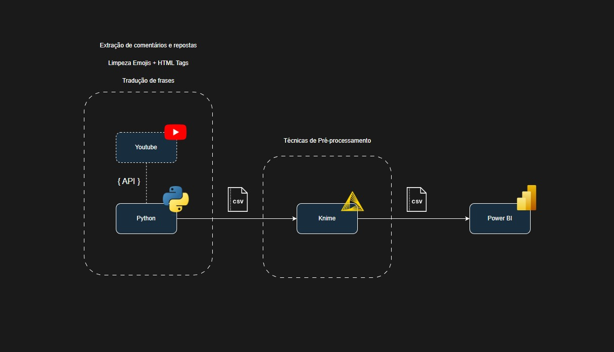
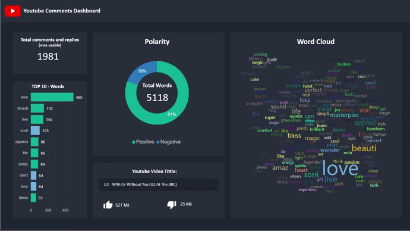

# Projeto de Ánalise de Comentário do Youtube

O projeto consiste em extrair comentários e respostas de qualquer vídeo do youtube, tratar e pré-processar esses valores e gerar um dashboard que aponte a polaridade dos comentários, nuvem de palavras, informações do video e ranking de palavras mais utilizadas.

----
## Diagrama




---
## Vídeo



---
## Como rodar:
- ```pip3 install -r requirements.txt```
- ```python3 yt_comments.py```
